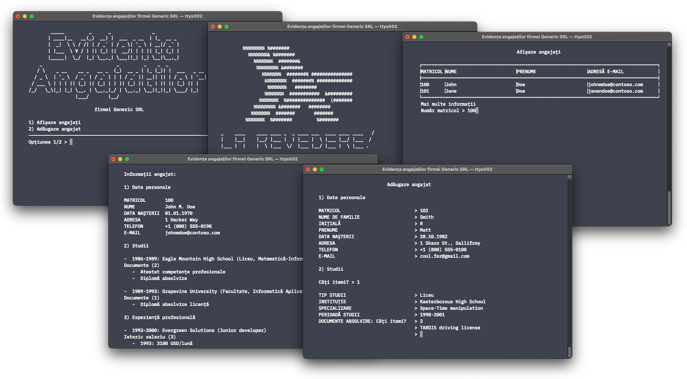

# employee-mgr

##  Synopsis 

Just a basic employee manager written in Haskell during the Functional Programming course of UniTBv; nothing more, nothing less. This tool can read from and write to CSV files, aggregate and display relevant information in an orderly fashion using the [ansi-terminal](https://hackage.haskell.org/package/ansi-terminal) package.

## Compile & run

First, make sure that [Stack](https://en.wikipedia.org/wiki/Stack_(Haskell)), the Haskell project builder, is installed. Then, in an UNIX shell (e.g. `bash`, `zsh`), execute the following commands:

- `chmod u+x ./Run.sh`
- `./Run.sh`